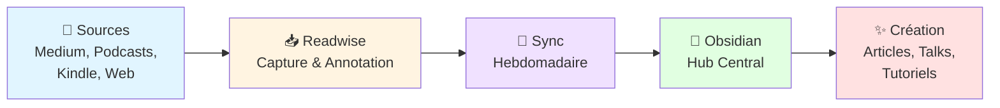

    Photo de <a href="https://unsplash.com/fr/@mostafa_meraji" target="_blank" style="color: #999;">mostafa meraji</a> sur Unsplash

Comme vous l'avez compris dans mon [précédent article](/blog/2025/10/mes-debuts-tech/), j'aime partager les articles, les podcasts ou autres trouvailles aussi bien auprès de mes collègues qu'au sein de ma communauté sur les réseaux sociaux.

Mais, face au déluge d’informations quotidiennes, comment trier l’essentiel sans s’épuiser ? Entre les nouvelles versions de frameworks, les bonnes pratiques d'architecture et le dernier outil à la mode, il est facile de se laisser submerger.

Le talk de Fabien HIEGEL et de David FRANCK à Devoxx en 2023 " Voyage au centre de la Veille : Apprendre en continu avec sa veille technologique" m'avait interpellé et me disait qu'il était temps pour moi de faire une veille technologique qui me permettrait de progresser.

Depuis plus d'un an, j'ai donc structuré ma veille autour d'un écosystème d'outils interconnectés : **Obsidian** comme centre névralgique. Je capture et relis mes « highlights » avec **Readwise**, j’écoute et annote des podcasts avec **Snipd**, et je lis des livres avec mon fidèle **Kindle**. Voici comment ces outils s'articulent dans ma routine quotidienne.

## Obsidian


Bien qu’**Obsidian** ne soit pas un logiciel open source, il est distribué gratuitement à vie, tant pour un usage personnel que professionnel. Il est multiplateforme et peut être téléchargé sur ordinateur (Linux, macOS, Windows) ou sur des appareils mobiles (tablettes ou smartphones).


**Obsidian** est un éditeur de notes au format Markdown. Il les stocke dans un répertoire localement sur mon ordinateur, et le tout est chiffré. Dans le jargon d’Obsidian, c’est appelé un « vault ». Il est bien sûr possible d’avoir plusieurs « vaults » pour séparer vos notes selon vos besoins. Pour ma part, je préfère stocker et organiser mes notes dans un seul « vault », ce qui est plus facile à synchroniser par la suite entre mes différents appareils.

Pour synchroniser son vault, il existe différentes solutions:
- Utilisation du plugin officiel de synchronisation. Dans ce cas, il est nécessaire de s'acquitter d'un abonnement auprès de l'éditeur d'Obsidian. C’est, à mon avis, l’un des moyens les plus faciles pour synchroniser ses notes entre un appareil sous iOS et son ordinateur. J’ai opté pour cette solution dans mon écosystème Apple (Mac, iPad et iPhone).
- Utilisation d'un plugin communautaire permettant la synchronisation via un dépôt GIT. C'est la solution la plus simple actuellement.

Dans la bibliothèque de plugin communautaire, il doit exister d'autres solutions de synchronisation que je n'ai pas testées.

Avec Obsidian, il est facile d’élaborer des templates de documents markdown adaptés à ses besoins. Par défaut, il existe un outil de templating assez simple. Pour obtenir des fonctions plus avancées, le plugin **Templater** est parfait. Il ajoute des fonctionnalités en JavaScript permettant d’étendre les possibilités du templating : lister les notes ayant un tag particulier, par exemple, ou d’autres fonctionnalités.

Pour ma part, j'utilise essentiellement ces plugins:
- Excalidraw : l'outil de diagramme bien connu totalement intégré dans obsidian
- QuickAdd : cet outil ajoute un menu au moment de créer une nouvelle note pour choisir quel template de note nous voulons appliquer.
- Readwise official: Il permet la synchronisation avec **Readwise** pour obtenir ses extraits.

Grâce à **Readwise**, je peux capturer les informations qui retiennent mon attention parmi toutes mes sources de veille, puis les classer dans des notes sur divers sujets avec **Obsidian**.

## Readwise

**Readwise** est une plateforme en ligne permettant de capturer différents types de contenus, de les lire, de les annoter et d’en retenir l’essentiel. Il est possible d’ajouter des vidéos YouTube, des articles sur le web, des publications de réseaux sociaux ou encore d’autres types de documents (en PDF ou dans d’autres formats). Grâce à son lecteur « read it later », je peux relire les contenus que j’ai capturés lors de mes séances de veille.

**Readwise** permet d’illustrer des passages intéressants en les soulignant et en y associant ses propres commentaires. Il dispose également d’outils pour synthétiser le contenu, en extraire les points clés et le classer automatiquement. Pour les vidéos YouTube, il récupère les transcriptions, ce qui permet de lire et d’annoter les propos tenus.

Readwise possède aussi des connecteurs pour récupérer des contenus ou des notes provenant de différents services web:
- la plupart des lecteurs d'ePub comme Kindle, Kobo, Google Books ou Apple Books
- des lecteurs RSS les plus courants comme Inoreader ou Feedly
- quelques lecteurs de podcasts comme Snipd

Je me sers essentiellement **Readwise** grâce à son plugin disponible pour la plupart des navigateurs. Cet outil s’avère indispensable, car il permet de souligner les passages intéressants d’un article en cours de lecture, puis de les annoter. De plus, l’extension enregistre automatiquement l’article ainsi que les notes prises.

Grâce à l’application **Readwise**, j’ai découvert **Snipd**, un lecteur de podcasts qui permet de résumer, d’annoter et d’extraire automatiquement les passages importants d’un épisode. Cette application se synchronise automatiquement avec Readwise.

## Snipd

**Snipd** est une application de lecture de podcasts boostée à l'IA. Elle est disponible sur iOS et Android. Le développement se fait en Suisse.

Une version gratuite est disponible, mais l'application révèle tout son potentiel avec un abonnement mensuel. L'IA y joue un rôle essentiel, car elle permet d'effectuer plusieurs fonctionnalités:
- Transcript automatique du podcast
- Génère automatiquement les moments forts du podcast en cours de lecture
- Permet de prendre des notes vocales pendant la lecture en récupérant le contexte (timestamp et extrait audio)


Depuis peu, il intègre l'importation de vidéos YouTube pour bénéficier des mêmes fonctionnalités que sur l'audio. Je n'ai pas encore testé cette fonctionnalité.


Ce lecteur m’est très utile, car j’écoute beaucoup de contenus audio pendant que je travaille, et que je fais du running ou de la marche. Cela me permet d'extraire les informations intéressantes pendant la lecture sans pour autant devoir écrire ce qui a retenu mon attention.

Concernant les podcasts, je suis assez éclectique. J'écoute aussi bien des contenus sur la tech bien entendu, mais aussi des podcasts politiques, d'histoire ou d'apprentissage des langues.

Parmi les podcasts que j'écoute le plus, voici une sélection:
- Le rendez-vous incontournable d'Emmanuel Bernard sur la veille Java mais pas que :  [Les cast codeurs](https://lescastcodeurs.com)
- Un podcast de Casonostra sur le développement en général  [If This Then Dev](https://www.ifttd.io)
- Les podcasts de NotPatrick sur l'actualité Tech (un avis éclairé sur l'influence de la Tech) [Le rendez-vous tech de NotPatrick](https://feeds.acast.com/public/shows/le-rdv-tech) et sur l'actualité des jeux vidéos [Le rendez-vous jeu de NotPatrick](https://feeds.acast.com/public/shows/le-rendez-vous-jeux)
- Un podcast intéressant sur l'IA [IA pas que la Data](https://iapasqueladata.transistor.fm)
- Mon podcast favori sur l'histoire par [Nota Bene](https://www.notabenemovies.com/podcasts/)
- L'actualité politique par Jean Massiet, streamer sur twitch [Backseat](https://podcasts.apple.com/fr/podcast/backseat/id1586604348)
- Le podcast KM42 pour se motiver pour faire mes séances de running [KM42](https://bertrandsoulier.com/km42/)
et bien d'autres encore
## Kindle

J’aime bien me réserver un petit moment pour lire avant de me coucher. Je lis des romans, des essais et, bien sûr, des ouvrages techniques.

Voici les ouvrages que j’ai récemment dévorés :
- Le grand détournement - Comment milliardaires et multinationales captent l'argent de l'État de Matthieu Aron et Caroline Michel-Aguirre
- La prophétie des abeilles de Bernard Werber
- Chip war de Chris Miller
- Building your mouseless development environment de Mathieu Cneude
- The Art of Kubernetes (French Edition)
- Hand's on Rust de Herbert Wolverson

Pour faciliter ma lecture, j’ai un **Kindle** depuis près de dix ans. J’ai d’ailleurs eu besoin d’en acheter un nouveau (un **Kindle Paperwhite**), car l’écran de mon premier appareil avait rendu l’âme après six ans.

Grâce au **Kindle**, je peux facilement mettre en évidence des passages, ce qui me permet de noter mes citations préférées dans un roman qui me serviront d’inspiration, ou de souligner des informations intéressantes dans un livre technique.

**Readwise** me permet ensuite d'importer ces citations ou extraits dans sa base qui pourront ensuite être traitées dans mon vault **Obsidian**.

## Medium

Une grosse partie de ma veille est la lecture d'articles sur Medium. Je trouve que c'est une source intéressante pour lire des articles de qualité sur différents sujets aussi bien techniques que de fond.

J'utilise les outils intégrés à Medium pour surligner les passages intéressants qui seront ensuite synchronisés avec Readwise.

## YouTube

Je regarde (enfin, j'écoute essentiellement) des vidéos YouTube dans tous les domaines. J'apprécie énormément les chaînes officielles des conférences comme devoxx France, devoxx, Touraine tech, Breizhcamp ou encore DevFest Nantes. Ces vidéos me permettent de me rattraper sur les conférences que je n’ai pas pu assister en direct. C'est une bonne source d'information que je partage aussi avec mes collègues.

Comme **Readwise** me permet de sauvegarder les vidéos pour les retranscrire et les annoter, c’est un bon moyen de se forger une opinion ou de creuser un sujet en particulier.

## Alors comment j'organise ma veille au final ?

Pour effectuer ma veille, je me tiens au courant en lisant ou en écoutant diverses sources d’information. Je prends habituellement une heure de mon temps pendant ma pause-déjeuner (ou, si j’en ai le temps, pendant ma pause-café). Je sauvegarde les articles et les publications sur les réseaux sociaux (principalement sur Bluesky et LinkedIn) à l’aide de la fonction « Read it Later » de **Readwise** pour pouvoir les lire plus tard.

Je prends alors le temps de lire en profondeur l'article et l'annote pour y mettre mes réflexions ou autres notes personnelles.

Chaque semaine, je synchronise manuellement mes notes avec l’extension **Readwise** sur **Obsidian** pour les récupérer. Cette extension est vraiment intéressante, car elle capture non seulement l’URL de la source, mais aussi les annotations et extraits que j’ai effectués.

Ces annotations me servent à rédiger une note rassemblant mes réflexions sur un thème particulier. Ainsi, je peux développer des tutoriels pour mes collègues, écrire des articles pour un blog ou préparer le sujet d’une prochaine conférence.

Pour résumer, voici donc mon workflow complet pour organiser ma veille :

## Pour conclure

Ce système n'est pas parfait et continue d'évoluer au fil de mes besoins. Mais après un an d'utilisation, il me permet de transformer une veille passive en apprentissage actif.

Les informations capturées ne restent plus dans des favoris oubliés : elles deviennent des notes structurées qui nourrissent mes articles, mes talks et mes échanges avec mes collègues.

Et vous, comment organisez-vous votre veille technologique ?

---


Quelques liens pour en savoir plus sur les références de cet article.
- [Site officiel d'Obsidian](https://obsidian.md)
- [Readwise](https://readwise.io)
- [Snipd - The AI-powered Podcast Player](https://www.snipd.com)
- Le talk de Fabien HIEGEL et de David FRANCK à Devoxx en 2023 - [Voyage au centre de la Veille : Apprendre en continu avec sa veille technologique](https://www.youtube.com/watch?v=AMOXbT4xVjk)

