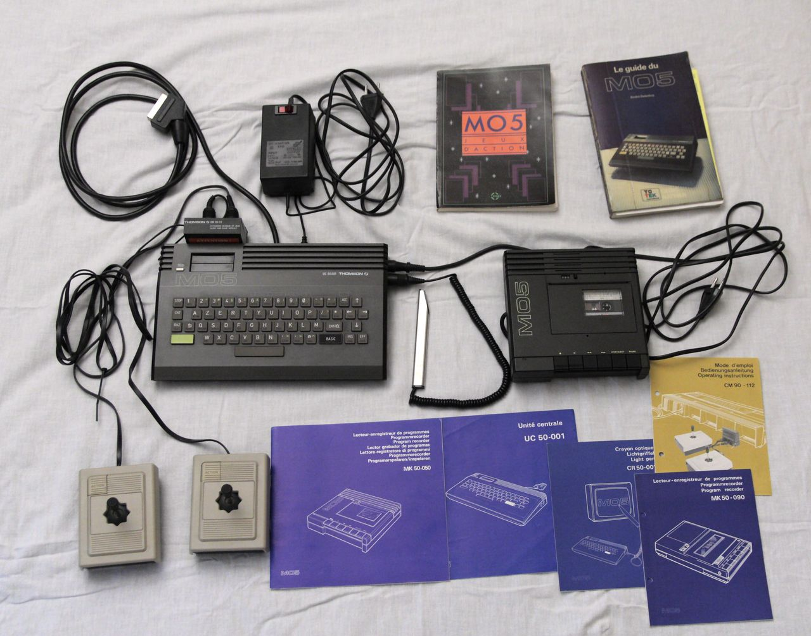
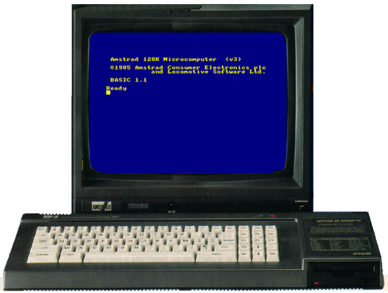
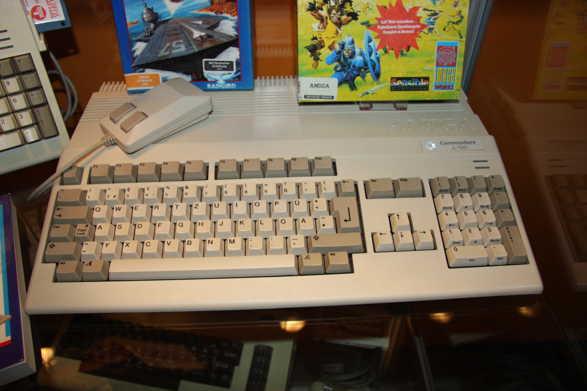

    Photo de <a href="https://unsplash.com/fr/@sjjillan" target="_blank" style="color: #999;">Sjjillan</a> sur Unsplash

Cette semaine, en discutant à la pause café, j'ai révélé mon âge où je suis en mission actuellement. Cela a surpris certains de mes collègues, qui ont même demandé à l’un d’entre eux s’il devait m’adresser la parole en me vouvoyant.

Effectivement, cette année marque mon cinquantième anniversaire. C’est un cap symbolique où l’on a souvent tendance à faire le bilan de son existence. Je me propose donc de revenir sur comment l’informatique est entrée dans ma vie.

Remontons quarante ans en arrière, jusqu’à mes dix ans. Je suis alors en CM2. En ce temps, l’internet n’existait pas, les smartphones étaient encore un concept futuriste et l’IA générative était une utopie. Les ordinateurs personnels n’étaient pas répandus dans les foyers français : seuls quelques privilégiés avaient la chance de pouvoir les utiliser.

À cette époque, le plan informatique pour tous était présenté par le Premier ministre. Ce plan consistait à équiper près de 50 000 écoles d'ordinateurs et à former aussi bien les enseignants que les écoliers.

À cette rentrée-là, j’ai pu ainsi toucher pour la première fois un ordinateur, et quel ordinateur ! Un Thomson MO5, qui avait une mémoire de 48 Ko d’origine, extensible jusqu’à 96 Ko. Il était équipé d’un lecteur de cassettes et d’un crayon optique.

Nous utilisions alors l'ordinateur pour apprendre aussi bien les mathématiques que la musique à l'aide de jeux éducatifs. Et nous pouvions aussi commencer à nous initier à la programmation grâce au basic.

Mes parents avaient pressenti que cet attrait pour les ordinateurs n'était pas une envie particulière, mais bien une passion naissante. Ils m’avaient donc offert cet ordinateur pour Noël. Je pouvais ainsi m’amuser, dessiner, et aussi appliquer les notions de programmation en basic que j’avais apprises à l’école. Et j'ai pu commencer à jouer aux jeux vidéos. Je me souviens des heures passées à essayer de faire atterrir mon Airbus A320 sur le jeu du éponyme.

L'envie de partager et d'apprendre était déjà là. À la rentrée en sixième, nous avons déménagé à Anglet, la commune voisine. C’est alors que j’ai découvert qu’un club informatique se trouvait à deux pas de la maison. Ce club existe toujours aujourd’hui, après près de 40 ans d'existence. Pour avoir de plus amples renseignements, vous pouvez aller sur la page officielle de l'association : <https://mica.asso.fr>

Le club était très bien doté pour l'époque avec de nombreuses machines iconiques, comme des Commodores 64, des Macs, des Amiga (1000 et 500).

À l'aide de bénévoles qui animaient des ateliers, j'ai pu mieux comprendre comment utiliser des logiciels de PAO sur Mac ou encore commencer à apprendre les rudiments de la programmation en Basic sur commodore 64.

Je me rappelle ma première expérience avec un Mac : Je cherchais désespérément comment éjecter la disquette du lecteur, mais je ne pouvais pas trouver le bouton pour l’expulser. Ce n’est que bien plus tard que j’ai appris qu’il suffisait de faire glisser l’icône de la disquette vers la corbeille.

Après mon MO5, j’avais pu avoir un CPC 6128. Je me souviens encore des longues heures que j’ai passées à reproduire des lignes de code provenant du magazine « hebdogiciel ».

Je ne compte pas le nombre de fois où une erreur de syntaxe ne m’a pas permis de pouvoir lancer le jeu ou le programme tant désiré. À cette époque, il n’y avait pas d’IDE et je devais taper la commande ligne par ligne pour que l’ordinateur puisse l’interpréter.

C’était l’apogée de la popularité d’Amstrad en France, une époque où c'était la dernière machine 8 bits à dominer le marché. Visualisez-vous la chance que c’était d’avoir 128 kilooctets de mémoire vive et des disquettes au format 3″ ? Je vous conseille d’ailleurs l’excellente vidéo retraçant l’histoire du CPC sur la chaîne d'origami (attention, près de trois heures de pure nostalgie). Et si d’aventure vous voulez vous replonger dans cette nostalgie, je vous conseille l’émulateur XCPC d’Olivier Poncet.

À l'adolescence, les jeux vidéos prenaient aussi une part importante et l'environnement y était propice. Je me souviens encore des frissons que j'avais en découvrant les démos des différents groupes connus de hacker en intro de jeux piratés.

Pour échanger nos jeux, il n’y avait pas de torrents ou de sites de téléchargement comme ceux d’aujourd’hui, mais nous échangions des disquettes avec les copains. Le plus dur était de se constituer un réseau nous permettant de récupérer les nouveautés.

En 1991, après avoir passé près de six ans dans le monde des ordinateurs 8 bits, j'ai franchi le pas en m'achetant un Amiga 500+ avec les économies que j'avais faites au fil du temps. L’Amiga était réputé pour ses capacités graphiques et pour ses jeux innovants. J'ai pu aussi continuer à coder des petits jeux à l'aide du BlitzBasic. Ce langage dérivé du Basic offrait un ensemble d’outils complets pour faciliter la conception de jeux (éditeur de sprites, boucle de jeu, etc.), une révolution à l’époque comparable aux environnements de développement intégrés (IDE) d’aujourd’hui. A noter que le Blitz Basic a été porté sur Windows et est toujours disponible.

Il y a 40 ans, j’ai écrit mes premières lignes de code en BASIC sur un Thomson MO5. Aujourd’hui, je comprends à quel point ces premières années ont influencé ma perception de la technologie actuelle.

Les valeurs qui m'ont animé sont toujours présentes:

**L'envie de partager** découverte au club MICA d'Anglet, quand nous échangions avec mes copains nos trouvailles sur les différents ordinateurs mis à notre disposition, n'a jamais disparu. Elle s'est simplement transformée. Les listings d'Hebdogiciel  ont laissé place à Github mais l'essence reste la même : transmettre ce qu'on a appris, aider les autres à progresser.

**L'esprit de collaboration** était déjà là, dans ces après-midis passés au club à élaborer de fausses affiches de cinéma avec nos professeurs du collège comme rôles principaux, à s'entraider pour débugger une ligne de code récalcitrante. Aujourd'hui, que ce soit en mission ou dans des projets open source, je retrouve cette même énergie collective qui me passionne.

**La curiosité technologique**, enfin, reste intacte. À l'époque, je guettais chaque numéro de Tilt pour découvrir les dernières nouveautés et rêver de pouvoir jouer à certains jeux ou posséder une machine plus puissante. Aujourd'hui, je continue cette veille avec les mêmes frissons d'excitation, qu'il s'agisse d'IA générative, de cloud computing ou de nouvelles pratiques de développement que je partage aussi bien sur mes réseaux sociaux qu'au sein de mon entreprise.

Alors oui, à 50 ans, je me rends compte que ce virus attrapé dans les années 80 n'était pas une simple passion d'enfant. C'était le début d'un chemin qui continue de me nourrir et de m'enthousiasmer. Et si mes collègues doivent me vouvoyer pour mes cheveux gris, qu'ils sachent que j'ai toujours la curiosité d'un gamin de 10 ans devant son premier ordinateur.

La tech évolue, les outils changent, mais l'envie d'apprendre, de partager et de créer ensemble reste mon moteur. Et je compte bien continuer longtemps.

---


Quelques liens pour en savoir plus sur les références de cet article.
- [Page Wikipedia Thomson MO5](https://fr.wikipedia.org/wiki/Thomson_MO5)
- [Test du jeu Airbus sur Thomson_MO5](https://youtu.be/94Kr85LPJcQ?si=_ICpm1A_3pABEaKL)
- [40 ans d'informatique pour tous grâce au MICA](https://www.sudouest.fr/pyrenees-atlantiques/bayonne/anglet-40-ans-d-informatique-pour-tous-grace-au-mica-19254622.php)
- [Émission de la chaîne Origami consacrée à l'Amstrad CPC](https://youtu.be/rtJ5H5b3CIU)
- [Site internet d'Olivier Poncet](https://www.emaxilde.net)
- [Les archives de Hebdogiciel](http://www.hebdogiciel.free.fr)
- [Une introduction au BlitzBasic](http://obligement.free.fr/articles/blitzbasic_bases.php)



Les images illustrants cet article sont issus de Wikimedia:
- [Thomson MO5](https://commons.wikimedia.org/wiki/File:Thomson_MO5.jpg)
- [Amstrad CPC 6128](https://commons.wikimedia.org/wiki/File:Amstrad_CPC_6128.png)
- [Commodore Amiga](https://commons.wikimedia.org/wiki/File:Commodore_Amiga_500_at_gamescom_2009-retro_games_section_PNr%C2%B00242.JPG)

