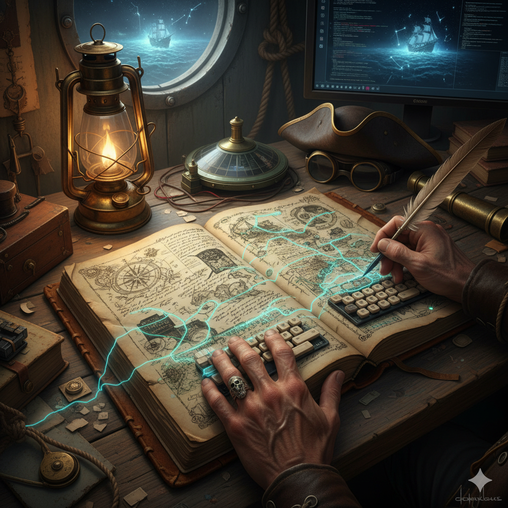

Photo de <a href="https://unsplash.com/fr/@martipaan" target="_blank" style="color: #999;">Martipaan</a> sur Unsplash

Bienvenue à toi, lecteur qui découvre pour la première fois mon blog. Cela fait plusieurs années que je me dis qu'il faudrait que je partage avec le reste du monde mes trouvailles lors de ma veille technologique, mais aussi mes expérimentations et retours d'expérience. J'ai longtemps procrastiné en me disant que ce que je peux raconter n'intéressera personne, ou encore que je ne suis pas à la hauteur par rapport à d'autres rédacteurs que je suis depuis plusieurs années.

Et en cette belle rentrée, je me suis dit que c'était l'occasion de prendre une nouvelle résolution. Et me voici, à vous écrire un soir ces quelques mots.

En bon hôte, je me présente. Pour ceux qui ne me connaissent pas, je suis David Drugeon-Hamon, la cinquantaine tout juste commencée, la calvitie naissante et connu sous le pseudo **zebeurton** sur les différents réseaux sociaux, mais aussi sous le nom de scène de **"Cul de bouteille"** à mes heures perdues.

## Pourquoi ce blog ?

Après près de 26 ans de carrière, aussi bien en tant que développeur, architecte, cloud builder ou encore site reliability engineer, il est temps pour moi de partager mes découvertes et expérimentations. Le virus de l'informatique m'a attrapé jeune, à l'époque du Thomson MO5 et des clubs informatiques de quartier, et il ne m'a jamais quitté.

Depuis 2022, je travaille pour la société de conseil WeScale et c'est dans ce cadre que j'ai pu écrire plusieurs articles sur le blog institutionnel de la société. Cette expérience m'a confirmé quelque chose d'essentiel : **écrire est un moyen d'apprendre et de transmettre du savoir**.

Le fait d'écrire oblige à creuser un sujet, à le triturer pour mieux le transmettre au lecteur. J'étais fier d'être cité par Xavki sur LinkedIn pour mon article sur vector.dev. C'était une reconnaissance du travail accompli et une confirmation que le partage a du sens.

Mais écrire sur un blog d'entreprise, aussi enrichissant soit-il, impose certaines contraintes. Ce blog personnel me donne la liberté d'explorer d'autres sujets, d'autres formats, et de partager au-delà du cadre professionnel strict.

## Ce que vous trouverez ici

À travers ce blog, j'aimerais partager plusieurs types de contenus :

**🔧 Retours d'expérience techniques** : des problèmes rencontrés en production, des solutions trouvées, des architectures mises en place. Le quotidien d'un SRE et cloud builder, sans filtre corporate.

**📚 Ma veille technologique** : les outils, pratiques et tendances qui m'intéressent. De l'observabilité au cloud native, en passant par tout ce qui touche à la fiabilité des systèmes.

**🧪 Expérimentations et POC** : j'aime tester de nouvelles technologies. Autant en profiter pour documenter et partager ces explorations.

**🎭 Et peut-être d'autres passions** : car un développeur ne vit pas que de code. D'où le nom "Cul de bouteille".

## "Cul de bouteille" ?

Vous vous demandez peut-être d'où vient ce nom étrange ? J'incarne depuis plusieurs années ce vaillant corsaire malouin lors de mes aventures avec l'équipage du Captain Popi. En effet, je pratique depuis plus de 20 ans l'escrime de spectacle. J'ai participé à plusieurs événements dont un court métrage et la fête des corsaires à Saint-Malo tous les étés depuis 2019.

Cette passion pour la scène et le spectacle vivant fait partie intégrante de qui je suis. Et qui sait, cela fera peut-être l'objet d'un article un de ces jours.

## La promesse

Je ne vous promets pas un rythme de publication effréné. La qualité prime sur la quantité. Mais j'espère que vous trouverez ici des contenus utiles, sincères et peut-être même inspirants.

Si un sujet vous intéresse particulièrement, si vous avez des questions ou des suggestions, n'hésitez pas à me le faire savoir. Ce blog est aussi un espace d'échange.

Merci d'être là pour cette première publication. On se retrouve très bientôt pour de la vraie tech !

David / zebeurton / Cul de bouteille 🏴‍☠️
