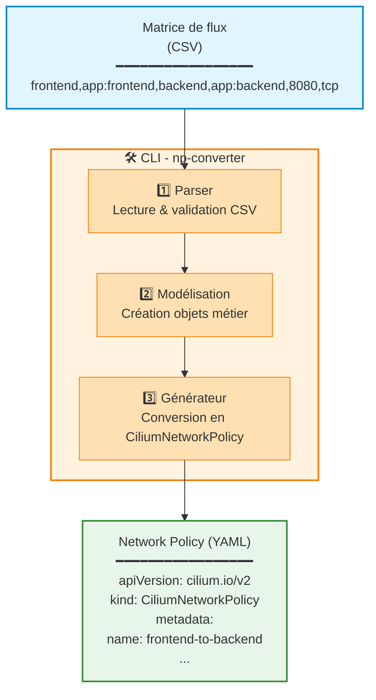

<p style="font-size: 0.75rem; color: #666; margin-top: 0.5rem; margin-bottom: 2rem;">
    Photo de <a href="https://unsplash.com/fr/@synkevych">Roman Synkevych</a> sur Unsplash
</p>

## Résumé

Appliquer le zéro trust sur un cluster Kubernetes n'est pas une tâche aisée : Il faut mettre en place différents outils pour l'authentification, la sécurité des flux réseaux, l'auditabilité et l'observabilité.

Concernant la sécurisation des flux réseaux, c'est définir ce qui est autorisé ou non entre les différents composants déployés sur un cluster. En pratique : près de cent vingtrègles à créer manuellement à partir d'une matrice de flux pour un seul cluster Kubernetes.

C'est une tâche fastidieuse et source d'erreurs. Face à ce défi, j'ai décidé de créer une CLI pour automatiser cette conversion... en utilisant un assistant de code IA.

Ce qui devait être un simple outil interne est devenu un terrain de jeu pour expérimenter le "vibe coding" avec Claude Code.

Dans cette série d'articles, je partage mon retour d'expérience sur un mois de développement assisté par IA en environnement de production : ce qui a marché, ce qui a échoué, et les leçons apprises.

> [!info] Le Vibe Coding ?
> **Andrej Karpathy**, ancien directeur chez Tesla en charge de l'intelligence artificielle et du pilotage automatique, a introduit et popularisé le terme de **vibe coding** en 2024. C'est une manière de coder en exprimant en langage naturel ce qu'une application devrait faire. C'est une approche où le code est principalement généré par une IA à partir d'instructions en langage naturel décrivant le comportement souhaité

**Dans ce premier article (partie 1/3)** : Je vous présente le contexte qui m'a amené à créer cette CLI, le défi technique posé par les network policies, et pourquoi j'ai choisi d'utiliser un assistant de code pour son implémentation.

## Le contexte : SRE dans une plateforme Kubernetes

Dans ma mission actuelle, je travaille en tant que SRE sénior dans une équipe qui propose une plateforme pour l'hébergement d'applications développées en interne. Cette plateforme se base sur des clusters Kubernetes créés par Cluster API (entres autres, mais ça c'est une autre histoire).

Un jour, mon PO exprime le besoin d'ajouter une couche de sécurité au niveau réseau pour isoler les différents composants d'une application. Normal me direz-vous mais ayant tout à construire ces aspects avaient été mis au fond du backlog. Enfin bon, je m'attaque à l'Epic : ajouter des règles pour sécuriser les applications.


> [!info] Mais au fait, c'est quoi une Network Policy Kubernetes ?
> **Network Policy** : Dans Kubernetes, une Network Policy est un objet qui définit les règles de communication réseau entre les pods. Par défaut, tous les pods peuvent communiquer entre eux. Elles permettent ainsi de restreindre ces flux pour améliorer la sécurité que ce soit au niveau d'un namespace, entre plusieurs namespaces ou depuis / vers l'extérieur du cluster.
>
> **Cilium** : Cilium est une implémentation de Network Policies basée sur eBPF (extended Berkeley Packet Filter) qui offre des fonctionnalités avancées de sécurité réseau et d'observabilité. Cilium propose son propre format (CiliumNetworkPolicy) avec des capacités étendues par rapport à celles de Kubernetes standard. Elles permettent d'autoriser des flux au niveau 3, 4 ou 7 en fonction des besoins. Par exemple, il est facile d'autoriser l'appel vers certains path au niveau d'une requête HTTP.
>
> **Matrice de flux** : Document (souvent un fichier CSV ou Excel) qui recense tous les flux réseau autorisés entre les différents composants d'une application : qui peut communiquer avec qui, sur quel port, quel protocole, etc. Cette matrice doit refléter tous les flux réseaux qui sont nécessaires au bon fonctionnement de l'application mais aussi tous les outils que nous mettons en place pour son observabilité ou son déploiement.  Historiquement, ce document était généralement pris en charge par les équipes réseaux pour configurer les pare-feux.

## Le défi : la matrice de flux

En ouvrant le ticket, je commence à lire la matrice de flux : Dans ce fichier y sont décrits pour chaque namespace de chaque cluster, les flux entrants et sortants pour les composants du namespace. A titre d'exemple, pour un cluster, il peut y avoir une quinzaine de namespaces comportant entre cinq et dix composants sans compter les composants permettant l'observabilité, le déploiement ou autres joyeusetés.

Cette matrice de flux était incomplète car il n'y avait que les flux applicatifs qui y étaient décrits. Cette simple tâche devient une tâche complexe pour avoir un ensemble exhaustif et cohérent. Heureusement, Cilium propose des outils d'observabilité qui permettent de facilement comprendre l'ensemble des flux réseaux d'un namespace.

Une fois la matrice de flux complétée, je commence alors à me dire que ce sera une charge importante pour la transformer en un ensemble de polices cohérentes (et qui ne ferme pas **TOUS** les flux par accident).

### Pourquoi c'est complexe ?

Créer manuellement des Network Policies à partir d'une matrice de flux présente plusieurs difficultés et peuvent être des sources d'erreurs :

1. **Volume important** : Une dizaine de namespaces avec plusieurs flux chacun = dizaines de policies à écrire
2. **Complexité du format** : Le format YAML des CiliumNetworkPolicy est verbeux et technique. Il existe différents moyens de décrire la même autorisation ou refus.
3. **Risque d'erreur** : Une erreur de syntaxe ou de logique peut couper des flux critiques
4. **Maintenance** : À chaque nouveau flux, il faut mettre à jour ou créer de nouvelles policies
5. **Cohérence** : S'assurer que toutes les policies suivent les mêmes conventions de nommage, labels, etc.

Exemple simplifié d'une ligne de matrice de flux dans le fichier CSV que j'ai défini:
```csv
source_namespace,source_labels,destination_namespace,destination_labels,port,protocol,cluster
frontend,app: frontend,backend, app: backend,8080,tcp,same-cluster
```

Et la Network Policy Cilium qui doit être obtenue:
```yaml
apiVersion: cilium.io/v2
kind: CiliumNetworkPolicy
metadata:
  name: frontend-to-backend
  namespace: frontend
spec:
  endpointSelector:
    matchLabels:
      app: frontend
  egress:
  - toEndpoints:
    - matchLabels:
        app: backend
        k8s:io.kubernetes.pod.namespace: backend
    toPorts:
    - ports:
      - port: "8080"
        protocol: TCP
```

Et ceci multiplié par le nombre de cluster (en général trois par environnement), le nombre de namespaces (entre dix et vingt par cluster) et le nombre d'applications déployées par namespace...

## L'idée : automatiser avec une CLI

En bon SRE, je me dis qu'il est temps pour moi d'automatiser. Et si c'était pour moi l'occasion de proposer une CLI aux équipes de développement pour leur faciliter la création de ces objets Kubernetes ?

### Pourquoi une CLI plutôt qu'un script ?

J'aurais pu créer un simple script Python ou Bash, mais j'ai choisi de développer une CLI complète en Golang pour plusieurs raisons :

1. **Outillage** : Le Golang est le langage utilisé chez mon client, il y a déjà des bonnes pratiques de développement, des pipelines CICD mis en place, et la connaissance des équipes de développement pour reprendre en main l'outil.
2. **Réutilisabilité** : Une CLI bien conçue peut être utilisée par toutes les équipes applicatives sans difficulté. Le cœur de la CLI est une librairie qui pourra être aisément intégrée dans d'autres outils de l'équipe
3. **Expérience utilisateur** : Commandes claires, aide intégrée, messages d'erreur explicites ce qui facilitera l'onboarding des équipes applicatives
4. **Évolutivité** : Plus facile d'ajouter de nouvelles fonctionnalités (validation, preview, différents formats de sortie) que d'un script bash
5. **Distribution** : Facile à installer et à maintenir

### Vision de l'architecture




Cette architecture en trois étapes — parsing, modélisation, génération — constitue le cœur de la CLI  — J'avais une idée claire de l'architecture logicielle que je voulais mettre en place. La couche métier doit être réutilisable sous forme d'une librairie. J'avais donc en tête de faire cette CLI sous forme d'architecture hexagonale pour être facilement étendue —  peut-être overkill vous me direz mais qui a fait ses preuves.

> [!note]
>L'architecture hexagonale (aussi appelée "Ports and Adapters") est un pattern d'architecture logicielle qui sépare strictement le cœur métier de l'application de ses dépendances externes (bases de données, APIs, CLI, UI, etc.).
>
>Le principe est simple : la logique métier centrale ne doit dépendre de rien, tandis que les composants externes s'adaptent à elle via des "ports" (interfaces) et des "adaptateurs" (implémentations concrètes).
>
>Dans le cas de mon projet, le cœur du métier contient toutes les règles métiers qui doivent être vérifiées (par exemple, le flux DNS doit être sur le port 53) et est indépendant de la représentation en entrée (ici CSV) et en sortie (en YAML).
> Ainsi, je peux changer le format d'entrée (supposons du JSON), les règles métiers ne seront pas changées. Et un autre avantage est de faciliter la testabilité de l'application.

Je voulais pouvoir aisément prendre en charge :
- **Différents types de fichiers en entrée** : CSV, YAML, JSON
- **Différents types de sorties** : Cilium, Kubernetes standard, ou autres CNI
- **Plusieurs commandes** : `validate`, `preview`, `generate` et qui serait facilement extensible ultérieurement.
- **Mode verbose** : Pour faciliter le diagnostic et le debug

## Et si je me faisais aider d'une IA ?

Cette architecture hexagonale bien pensée, ces multiples adaptateurs, ces commandes extensibles... J'avais le design en tête, mais l'implémenter proprement prendrait du temps : facilement 2 à 3 semaines pour développer la CLI avec ses différents adaptateurs (CSV, YAML, JSON), ses générateurs (Cilium, Kubernetes standard), et tous les tests qui vont avec.

Du temps que je n'avais pas vraiment, entre mes autres responsabilités de SRE dans l'équipe, pour un outil qui ne servirait au final que quelques fois par an lors de la configuration initiale des network policies.

C'est là qu'une idée s'est imposée : et si c'était justement l'occasion parfaite de tester en conditions réelles les assistants de code dont on parlait tant ? Un vrai projet avec de la valeur métier, une architecture claire, mais un budget temps limité.

Depuis un an, j'anime avec un collègue un groupe de travail à propos de l'IA générative au sein de ma société. Nous faisons de la veille, nous créons des prototypes pour monter en compétences ou faisons des présentations en interne pour vulgariser les concepts.

Je me suis alors dit que c'était l'occasion de m'aider d'un assistant de code pour créer cette CLI.

C'est cette réflexion qui a lancé mon aventure dans le **"vibe coding"**.

### Les questions qui se posent alors

Avant de me lancer, plusieurs questions me viennent à l'esprit :

- **Est-ce que ça va vraiment marcher ?** Est-ce qu'une CLI générée par un assistant de code sera de qualité professionnelle et maintenable ?
- **Combien de temps ça va prendre ?** Plus ou moins qu'un développement classique ?
- **Quelle sera la qualité du code ?** Est-ce que l'assistant de code respectera l'architecture logicielle définie ? Est-ce que le code sera facilement testable ?
- **Quelle sera ma vraie valeur ajoutée ?** Qu'est-ce que je fais en tant que senior, qu'est-ce que l'IA fait ?

Autant de questions auxquelles je vais pouvoir répondre en expérimentant concrètement.

## Dans le prochain article

Maintenant que le contexte est posé, il est temps de choisir l'outil qui va m'accompagner dans cette aventure. Dans le prochain article, je vous explique :

- Pourquoi j'ai choisi Claude Code parmi tous les assistants de code disponibles
- Mon expérience d'animation de la communauté IA chez WeScale
- Le processus d'évaluation que nous avons mis en place
- Les forces spécifiques de Claude Code pour ce type de projet

 **[Lire la partie 2 : Pourquoi Claude Code ?](#)** *(à venir)*

---


Quelques liens pour en savoir plus sur les références de cet article.
- [Documentation Kubernetes sur les Network Policies](https://kubernetes.io/docs/concepts/services-networking/network-policies/)
- [Documentation Cilium](https://docs.cilium.io/)
- [Page Wikipedia sur Cluster API](https://cluster-api.sigs.k8s.io/)

