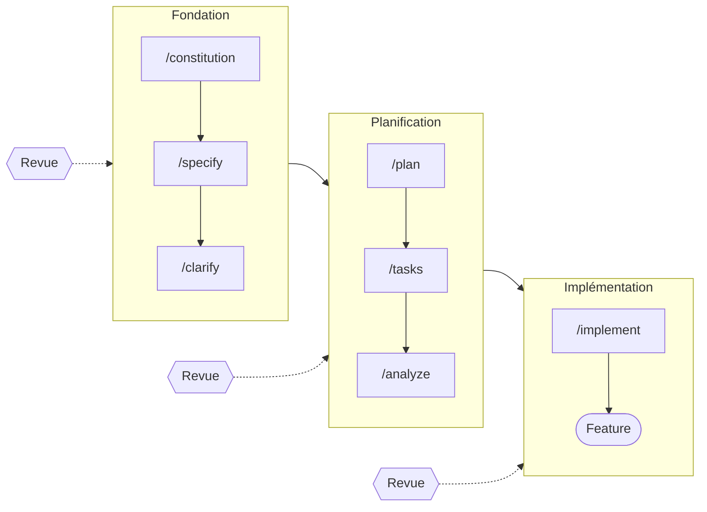

<p style="font-size: 0.75rem; color: #666; margin-top: 0.5rem; margin-bottom: 2rem;">
    Photo de <a href="https://unsplash.com/fr/@simonkadula">Simon Kadula</a> sur Unsplash
</p>

## Résumé des épisodes précédents

Dans cette série d'articles, je vous explique comment j'ai voulu vibe coder une application suite à un besoin chez mon client. 

Dans la [première partie](/blog/2025/11/vibe-coder-cli-part1/), je vous ai expliqué quelle était la problématique à résoudre à savoir comment automatiser la génération de "cilium network policies" à partir d'une matrice de flux complexe.

Dans la [deuxième partie](/blog/2025/11/vibe-coder-cli-part2/), je vous ai présenté pourquoi j'ai choisi Claude Code comme assistant de code pour catalyser le développement de cet outil.

**Dans cette dernière partie** : nous verrons comment j'ai utilisé concrètement cette CLI avec Claude Code avec un retour d'expérience sur son utilisation.

## Par où commencer ?

En tout bon développeur, j'aime bien commencer par le "Comment" plutôt que par le "Pourquoi". Ce n'est pas forcément la meilleure approche pour définir clairement le besoin - d'ailleurs, j'ai toujours dans ma liste de lectures le livre [Start with Why de Simon Sinek](https://www.amazon.fr/dp/B0F6X8P3L5) que des collègues m'ont recommandé. 

Il était temps pour moi d'avoir une liste de fonctionnalités nécessaires pour cette CLI pour avoir un MVP. Claude en mode chat sur le web est un bon moyen pour brainstormer. En ayant le bon prompt, les interactions avec Claude sont plus efficaces.


> Pour obtenir un meilleur prompt, qui de mieux que Claude pour le générer. 
> Une des utilisations que je fais est de définir ce que j'aimerai que Claude fasse et lui demande de générer un prompt efficace pour réaliser cette tâche.
> Je peux ensuite le raffiner pour ensuite l'utiliser directement dans l'interface Web


Par exemple, j'ai utilisé ce modèle de prompt pour facilement définir les personas qui utiliseront cette CLI ainsi que les différentes fonctionnalités que j'aimerai implémenter:

```markdown
# Prompt pour le Brainstorming Produit 
Tu es un expert en product management et en design thinking. Je souhaite que tu m'accompagnes dans la définition complète de mon produit. 
**Mon idée de produit :** [Décris ici ton idée en 2-3 phrases]
**Contexte/Problème à résoudre :** [Le problème ou besoin à adresser] 
**Ma cible initiale :** [Ta cible si définie] 

Je souhaite que tu m'aides à : 
1. **Définir 3-5 personas** : profil, frustrations, objectifs, maturité tech 
2. **Mapper les fonctionnalités** en MoSCoW (Must/Should/Could/Won't Have) 
3. **Créer 5-10 user stories** au format "En tant que X, je veux Y afin de Z" 
4. **Identifier les risques** et hypothèses critiques à valider 
5. **Proposer un plan de validation** avec métriques de succès Adopte un ton constructif et challenge mes idées. Pose-moi des questions clarifiantes si nécessaire.
```

Après plusieurs échanges pour s'assurer qu'il n'y a pas d'ambiguïtés sur le besoin, j'ai une liste de user stories à implémenter avec leur priorisation pour réaliser un MVP, il est temps de commencer l'implémentation.

## Premiers pas avec Claude Code

Jusqu'à présent, j'utilisais Claude en mode web et chat. Comme je vous le disais dans l'article précédent, j'utilisais Junie de Jetbrains comme assistant de code, mais, en réponse à des limites d'utilisation trop basses, j'avais décidé d'installer Claude Code après avoir pris un abonnement pour pouvoir l'essayer.


> Claude code est lancé avec la commande `claude`. C'est un système de chat comme sur le web. La syntaxe peut être déroutante au début :
> - Pour lancer une commande, il faut la préfixer par /
> - Pour ajouter un ou plusieurs documents au contexte, il faut le préfixer par @
> 
> Et pour information, Claude Code permet de copier coller des images qui seront ajoutées au contexte pour analyse. C'est pratique pour débugguer ou demander de produire un frontend à partir d'un design.


Une fois que le projet créé, il est nécessaire d'ajouter les différents fichiers nécessaires:
- le gitignore
- la configuration pour le pre-commit
- un makefile ou encore mieux un fichier de Tasks ([mise](https://mise.jdx.dev/getting-started.html))
- un README.md décrivant le projet

et le fichier **CLAUDE.md**. Ce fichier est chargé par Claude Code, à chaque fois qu'une nouvelle conversation est lancée, dans son contexte. Il lui permet de comprendre le projet avec ses guidelines (quels sont les frameworks utilisés, comment le builder, le tester, les principes d'architectures et de développement, etc.)


> Pour facilement créer ce fichier, n'hésitez pas à demander à Claude Code de le générer à l'aide de la commande `/init`. Vous pourrez ensuite le modifier pour rajouter des contraintes sur comment tester le code généré, le fait d'utiliser le linter pour le langage du projet à chaque fois que du code est ajouté, etc.


Le projet est prêt à être implémenté. Comment faire alors pour démarrer ? Quelle commande implémenter d'abord ? Quelle architecture logicielle choisir ?

De nombreuses questions se posent et sont généralement pensées lors du sprint 0 d'un projet où nous réfléchissons et posons les bases.

Claude Code possède un mode appelé "plan". Il est alors possible de brainstomer comme je l'aurai fait dans Claude Chat. Dans ce mode, l'assistant pourra proposer des solutions, des idées d'architecture, mais n'éditera aucun fichier. C'est le mode à privilégier lorsque l'on veut comprendre un projet existant ou quand on doit réfléchir comment et où intégrer une nouvelle fonctionnalité.

Dans mon cas, j'avais envisagé d'implémenter ma CLI sous forme d'une architecture hexagonale. J'ai pu confronter mon idée à Claude pour vérifier si c'est une bonne idée.

```
Welcome to Opus 4.1

> j'envisage de faire une cli qui à partir d'un fichier csv décrivant une matrice de flux me génère des network policies cilium. J'aimerai écrire cette cli en golang sous forme d'architecture hexagonale. j'aimerai aussi avoir plusieurs entrée possible. La cli pourrait être réutilisée sous forme de lib et pourra générer d'autres types de format de sortie (comme le markdown par exemple pour la documentation).Peux tu me dire si c'est une bonne approche ou si c'est overkill

Avec ces contraintes, l'architecture hexagonale est
totalement justifiée. Tu as exactement le cas d'usage idéal :
 - Multiples entrées (CSV, potentiellement JSON, YAML, API...).
 - Réutilisation en lib (le domaine doit être découplé de la CLI) 
 - Multiples sorties(CiliumNetworkPolicy, Markdown, autres formats)

...
```

Et Claude me propose l'organisation en package à implémenter ainsi que les premières structures et méthodes. Il me propose aussi des solutions alternatives plus simples, mais qui ne respectent pas mes contraintes.


>  Pour mémoriser les informations importantes, n'hésitez pas à appeler la commande /memory
>  Les informations seront alors stockées dans le fichier CLAUDE.md.


Les premières interactions sont plutôt grisantes, la génération de code est rapide et les fonctionnalités s'enchaînent.

J'ai ainsi pu commencer à avoir le cœur de mon application (la couche domaine dans le jargon) ainsi que les services associés rapidement, le tout avec une bonne couverture de tests.

Mais en regardant de plus près, Claude génère du code incohérent entre chaque fonctionnalité. Par exemple, les tests unitaires ne sont pas codés avec le même modèle.

Un autre exemple : Même si j'avais mis dans le fichier CLAUDE.md de respecter mes règles du linter golangci-lint, je me retrouvais à lui demander de temps en temps de vérifier si le code était conforme.

Comment rendre pérennes les développements de nouvelles fonctionnalité ? 
Comment s'assurer alors que Claude Code respecte les mêmes conventions de codage, respecte l'architecture déjà en place quand il doit la développer ?

Même si le fichier `CLAUDE.md` permet de rajouter des contraintes, il risque de devenir de plus en plus gros à chaque nouvelle feature implémentée. Le contexte devient alors de plus en plus important et rendra Claude Code moins efficace.

Il manque donc une étape cruciale entre "J'ai une idée d'une nouvelle fonctionnalité à implémenter" et «  Claude implémente la » : la **spécification**. Sans elle, Claude repart de zéro lors d’une nouvelle session sans tenir compte des choix déjà tranchés.

## La découverte de Speckit

Et c'est à ce moment que je vois ce message sur Bluesky de Tugdual Grall de Github :


En réponse à son message, je lui dis qu'actuellement, j'essaie de spécifier au maximum les fonctionnalités pour être sûr d'obtenir de l'assistant de code les fonctionnalités attendues. Et, il me donne alors un lien vers Speckit.


Intrigué, je commence à lire la documentation. J'en conclus que c'est une bonne méthode pour aider à spécifier les fonctionnalités puis à les implémenter avec un agent de code.

## Speckit ou quand le développeur devient Product Owner

Speckit  ajoute un cadre sous forme d'outils que nous allons ajouter à notre assistant de code.


>  Pour information, Speckit est compatible avec Claude Code, Gemini CLI et bientôt OpenAI Codex.
>  
>  Dans la suite de l'article, je prendrai l'exemple de Claude Code. Avec Gemini CLI, vous aurez le même workflow et les mêmes commandes. 


Je me suis alors dit que c'était exactement ce qu'il me fallait pour "vibe coder" ma CLI.

### Réflexion sur les fonctionnalités

Une fois les commandes installées, je commence alors à réfléchir aux fonctionnalités que j'aimerais implémenter :

- **Gestion des fichiers d'entrée** : supporter le format CSV, valider le format d'entrée, gérer plusieurs fichiers en entrée
- **Commandes principales** : `validate`, `preview` et `generate`
- **Améliorer l'expérience utilisateur** : proposer un mode verbose pour faciliter le diagnostic, messages d'erreur explicites
- …

## Le "vibe coding" en action : du besoin à la spécification

Une fois que j'ai une première version fonctionnelle de ma CLI, je me dis qu'il serait bien d'avoir un mode verbose pour faciliter le débug quand je génère des network policies.

Le workflow Speckit se décompose en plusieurs phases avec un point commun : **l'humain reste dans la boucle à chaque étape** pour valider les artefacts générés.



| Commande                | Description                                                                                                  |
| ----------------------- | ------------------------------------------------------------------------------------------------------------ |
| `/speckit.constitution` | Créer la constitution du projet à partir du fichier `CLAUDE.md` et des interactions faites avec l'utilisateur |
| `/speckit.specify`      | Décrire la fonctionnalité (le "quoi" et le "pourquoi")                                                       |
| `/speckit.clarify`      | Clarifier les zones d'ombre via des questions structurées                                                    |
| `/speckit.plan`         | Créer le plan technique avec l'architecture choisie                                                          |
| `/speckit.tasks`        | Générer la liste des tâches d'implémentation                                                                 |
| `/speckit.analyze`      | Vérifier la cohérence entre les artefacts                                                                    |
| `/speckit.implement`    | Exécuter les tâches et générer le code                                                                       |

### Étape 1 : Poser les fondations du projet

```bash 
/speckit.constitution 
```

Cette commande initialise les fondements du projet en générant le fichier `constitution.md` dans le répertoire `.specify/memory/`. Claude analyse le fichier `CLAUDE.md` existant et pose les questions pour clarifier:
- Les principes architecturaux du projet (clean architecture, etc.)
- Les conventions de codage à respecter (nommage, hiérarchie des fichiers à produire, etc. )
- Les modèles attendus (TDD, couverture de test minimale)
- Le langage, leurs dépendances et les frameworks utilisés.

Ce fichier devient la **référence immuable du projet** : chaque nouvelle feature spécifiée devra respecter cette constitution.

Voici un extrait de la constitution générée pour mon projet :

```markdown
# Cilium Network Policy Generator Constitution 

## Core Principles 

### I. Domain-Driven Design (NON-NEGOTIABLE) 

The domain layer MUST remain pure and isolated from all external dependencies. 
[...] 

### II. Clean Architecture Layers

 All code MUST respect strict architectural layer boundaries: Domain → Application → Infrastructure.
[...]
```

### Étape 2 : Décrire le besoin

```bash 
/speckit.specify "validate command with verbose error reporting" 
```

Grâce à cette commande, Claude effectue ces actions :

1. **Création du répertoire de feature** : `specs/003-verbose-error-details/` à la racine du projet
2. **Création d'une branche GIT dédiée** : `003-verbose-error-details`
3. **Création d'un fichier `spec.md`** décrivant la fonctionnalité :
- 3 User stories priorisées
- Des critères d'acceptances sous la forme Given/When/Then, pratique pour valider la fonctionnalité
- Des requirements fonctionnels (environ une dizaine)
- Des critères de mesures permettant de s'assurer que la fonctionnalité est pertinente
- Et surtout une liste de Edge cases qui seront à traiter dans la phase de clarification

Voici un extrait du document `spec.md` généré :

```markdown
[...]
### User Story 1 - View Detailed Validation Errors (Priority: P1)

Platform engineers need to quickly identify and fix validation errors
in flow matrix CSV files during development and troubleshooting.

**Acceptance Scenarios**:
1. Given a flow matrix CSV with validation errors
   When user runs `cnpgen validate <file> --verbose`
   Then each error is displayed with line number, field name, error message,
        and severity level

### FR-001: System MUST display each validation error with line number,
field name, error message, and severity level when --verbose flag is used
[...]
```


> Les différents fichiers générés dans les différentes étapes du workflow sont créés à partir des modèles markdown que vous trouverez dans le répertoire .specs.


Claude ne prendra pas de choix à votre place, quand il y a une ambiguïté pendant cette phase de spécification, il notera le point en ajoutant "Clarify". Vous pouvez lever ces ambiguïtés en invoquant la commande `/speckit.clarify`.

### Étape 3 : Clarification et raffinement

```bash
/speckit.clarify
```

Cette phase est à exécuter juste après la phase de spécification, avant de passer à la planification. Elle permet de lever toutes les ambiguïtés identifiées par Claude. Cela permet à l'utilisateur de faire des choix pragmatiques sur les zones d'ombres identifiées dans le fichier `specs.md`

Pour chaque point à clarifier, Claude propose plusieurs options possibles avec leurs avantages et inconvénients. Ce sera alors **à VOUS de trancher** pour choisir la solution la plus appropriée.

Voici un exemple concret que j'ai rencontré grâce à la spécification de ma fonctionnalité du mode verbose : 

```markdown
**Point à clarifier : Gestion des fichiers volumineux (100+ erreurs)**
| Option | Description | 
|--------|------------------------------------------|
| A | Afficher toutes les erreurs |
| B | Limiter à 50 erreurs + "et X autres..."|
| C | Pagination interactive |
```

J'ai ainsi choisi l'option B : un compromis pragmatique entre exhaustivité et lisibilité, tout en restant compatible avec une utilisation en pipeline CI/CD. 

Une fois tous les points clarifiés, Claude met à jour le fichier `spec.md` avec vos décisions. Vous obtenez alors une spécification complète et sans ambiguïté, prête pour la phase de planification.


> N'hésitez pas à relancer `/speckit.clarify` plusieurs fois si de nouvelles questions émergent. 
> Mieux vaut passer du temps pendant cette phase plutôt que de découvrir des zones d'ombres pendant l'implémentation. 
> Cela évitera des surprises ensuite lors des tests de la fonctionnalité. 😅


### Étape 4 : Planification des changements à apporter

Avant de générer du code pour les user stories, Speckit propose une phase de planification. 

```bash
/speckit.plan We would like to output errors and warnings into a table and to log generation steps
```

Grâce au fichier `CLAUDE.md`et au fichier `spec.md`, notre assistant de code génère le fichier `plan.md` dans le répertoire de notre fonctionnalité. Ce fichier décrit 
- La stack technique à utiliser (langage, version, dépendances)
- Les fichiers à créer ou modifier
- L'ordre des modifications et leurs dépendances
- Les impacts sur l'architecture existante

Voici un exemple extrait du fichier `plan.md` correspondant à ma feature

```markdown
[...]
## Summary

Enhance the `cnpgen validate` command to provide detailed error information when the `--verbose` flag is used. Currently, validation reports only "validation failed with N errors" without showing what failed or where. This feature will display each error with line number, field name, error message, and severity level in both human-readable (ASCII table) and machine-readable (JSON) formats.

**Technical Approach**: Extend existing ValidationReporter infrastructure to support verbose mode, add ASCII table formatting for text output, enhance JSON structure with complete error details, and implement progressive error reporting for large files.

## Technical Context
[...]
```

### Étape 5 : Découpage en tâches

Nous avons notre contrat technique, nous pouvons maintenant faire le découpage en tâches de chaque User Story. C'est exactement ce que ferait l'équipe avant de commencer l'implémentation. Cette étape est nécessaire pour connaître les différentes tâches à réaliser, leurs dépendances et leurs priorités.

```bash
/speckit.tasks
```

Dans cette étape, Claude écrit dans le fichier `tasks.md` (répertoire `specs`) les différentes tâches. Il peut effectuer des recherches sur internet pour leur implémentation et donne la possibilité à l'utilisateur de faire des choix techniques. 

Par exemple, lors de la phase de planification, j'ai demandé à avoir un résumé sous forme tabulaire des erreurs et warnings trouvés pendant la validation de mes network policies. Claude m'a proposé différentes librairies en Go permettant de formater mes données sous forme tabulaire, avec leurs avantages et inconvénients.

Voici un extrait du résultat de cette phase :

```markdown
[...]
## Overview

This document contains the implementation tasks for adding detailed validation error reporting with `--verbose` flag support. Tasks are organized by user story to enable independent, incremental delivery.

**MVP**: User Story 1 (P1) provides the core value - detailed error display for developers.

---

## Task Summary

| Phase | Description | Task Count | Parallelizable |
|-------|-------------|------------|----------------|
| Phase 1 | Setup & Dependencies | 3 | 2 |
| Phase 2 | Foundational Infrastructure | 4 | 3 |
| Phase 3 | User Story 1 (P1) - Detailed Error Display | 8 | 4 |
| Phase 4 | User Story 2 (P2) - JSON Output | 3 | 2 |
| Phase 5 | User Story 3 (P3) - Progressive Display | 3 | 1 |
| Phase 6 | Polish & Documentation | 3 | 3 |
| **Total** | | **24** | **15** |

[...]
```

### Étape 6 : Analyse

```bash /speckit.analyze ```

Cette phase est optionnelle et doit être exécutée entre les phases de découpage en tâche et la phase d'implémentation. Elle permet d'analyser la cohérence et surtout la couverture des besoins définis entre tous les artifacts générés lors des phases précédentes.

Claude produit un rapport d'analyse détaillé qui examine les points suivants :
- **Les ambiguïtés** : des critères de succès trop vagues (ex: "La génération doit être faite sous 10 secondes")
- **Les zones sous-spécifiées** : des edges cases documentées dans le fichier `specs.md` mais qui ne sont pas couvertes par des tâches décrites dans le fichier `tasks.md`
- **Les incohérences** : Des décisions déjà prises mais non trouvées dans les documents générés.

Le rapport inclut également un tableau de couverture qui associe chaque requirement fonctionnel aux tâches qui l'implémentent : 

| Requirement                         | Couvert ? | Tâches    |
| ----------------------------------- | --------- | --------- |
| FR-001 (affichage détaillé erreurs) | ✅        | T009-T012 |
| FR-005 (format tableau ASCII)       | ✅        | T004-T006 |
| FR-007 (info phase validation)      | ⚠️        | Implicite |

Enfin, Claude vérifie si les différents documents pour cette spécification respectent les guidelines du projet décrits dans le fichier `constitution.md`

| Principe | Statut | 
| ----------------------- | ----------- |
| Domain-Driven Design    | ✅ CONFORME | 
| Clean Architecture      | ✅ CONFORME | 
| Test-Driven Development | ✅ CONFORME |

Dans l'analyse des différents fichiers pour ma feature concernant le mode verbose, Claude a détecté trois problèmes de sévérité moyenne et sept mineures. Aucun problème bloquant n'a été relevé.

Verdict:

✅ **PRÊT POUR L'IMPLÉMENTATION**

## Et pour conclure : Mission accomplie, le code augmenté est industrialisé

En partant d'un besoin simple — transformer de manière fastidieuse plus d'une centaine de règles de flux en Network Policies Cilium — j'ai pu expérimenter le "vibe coding" en conditions réelles.

Ce qui aurait dû me prendre au moins deux sprints (architecture hexagonale, règles métiers, interfaces, intégration Cobra...) m'aura finalement pris moins d'un sprint pour obtenir un MVP déjà utilisé par les équipes.

Dans cette série d'articles, j'ai voulu partager ma démarche, tester ce "vibe coding" tant vanté sur les réseaux sociaux, tout en restant pragmatique et professionnel.

### Les Enseignements Clés : La Méthode avant le Vibe

1. **Le vibe coding sans méthode mène au chaos** — Les premières sessions sont grisantes, mais produisent du code incohérent et difficilement maintenable.

2. **Le spec-driven development demande un investissement initial** — Mais il se rentabilise dès la deuxième feature implémentée, car il force la clarté et l'alignement avant l'écriture de la première ligne de code.

3. **L'IA ne remplace pas l'humain, elle l'augmente** — À chaque étape du workflow Speckit, la boucle de feedback reste indispensable pour s'assurer que l'implémentation correspond au besoin.

4. **La qualité du prompt détermine la qualité du résultat** — 80% du succès vient de la façon dont on guide l'assistant. C'est la compétence clé à raffiner.

### Le Développeur 2.0 : De Coder à Architecte

Pour finir, notre assistant de code est une équipe de développement à laquelle il faut expliquer le besoin (le "pourquoi", pas le "comment"), clarifier les choix techniques et valider les livrables. 

Le développeur en 2025 doit acquérir des compétences de **Product Owner** qui définissent le besoin, **d'Architecte** qui valident la solution technique, de **reviewer** et de **testeur** qui garantissent la qualité du code généré. 

En tant que senior, j'ai eu l'occasion de développer ces compétences au fil de ma carrière — mais quid des juniors qui arrivent sur le marché ?

L'approche de Speckit n'est pas isolée. D'autres initiatives suivent cette mouvance, comme l'éditeur **Kiro** d'AWS — un IDE basé sur VS Code qui intègre nativement les mêmes paradigmes de spécification, planification et implémentation. Quand un géant comme AWS investit dans le développement piloté par les spécifications, c'est un signal fort : l'industrie logicielle est en train de se structurer autour du vibe coding.

Et cette CLI de génération de Network Policies me direz-vous ? Elle a été utilisée en production pour aider à générer les policies par les équipes. D'ailleurs, le cœur du projet a déjà été intégré sous forme de librairie dans un autre outil interne.

Cette CLI m'a fait gagner des semaines de travail et j'ai déjà des retours intéressants d'évolution. **Bref, Mission accomplie !**

## Remerciements


- Tugdual Grall qui m'a fait découvrir Speckit
- Les membres enthousiastes de la communauté IA de WeScale


## Sources


- [Documentation Claude Code](https://platform.claude.com/docs/en/intro)
- [Claude code best practices](https://www.anthropic.com/engineering/claude-code-best-practices)
- [Page officielle du projet Speckit](https://speckit.org)
- [Description de l'approche Spec driven](https://github.com/github/spec-kit/blob/main/spec-driven.md)
- [Vidéo de Korben présentant Speckit](https://youtu.be/92QUC8OMVq0)
- [Article expliquant l'architecture hexagonale](https://www.numendo.com/blog/back/architecture-hexagonale-principes-avantages-et-implementation-pratique/)
- [Kiro](https://kiro.dev)

